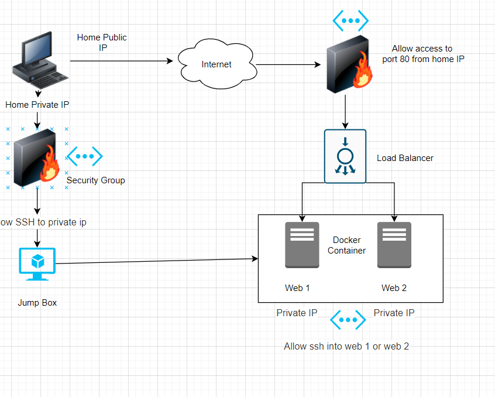

# Cyber-Security-Boot-Camp
Cyber Book Camp Materials
## Automated ELK Stack Deployment

The files in this repository were used to configure the network depicted below.

These files have been tested and used to generate a live ELK deployment on Azure. They can be used to either recreate the entire deployment pictured above. Alternatively, select portions of the deployment file may be used to install only certain pieces of it, such as Filebeat.

- install-elk-playbook.yml

This document contains the following details:
- Description of the Topology
- Access Policies
- ELK Configuration
  - Beats in Use
  - Machines Being Monitored
- How to Use the Ansible Build

### Description of the Topology

The main purpose of this network is to expose a load-balanced and monitored instance of DVWA, the D*mn Vulnerable Web Application.

What aspect of security do load balancers protect? What is the advantage of a jump box?

Load balancing protects the system form DDos attacks by shifting attack traffic.  The advantages of a jump box is to give access to a user from a single point of entry that can be secured and monitored.

Integrating an ELK server allows users to easily monitor the vulnerable VMs for changes to the application and system logs.

What does Filebeat watch for?  Filebeat monitors the log files or locations that you specify, collects log events, and forwards them either to Elasticsearch or Logstash for indexing
What does Metricbeat record? Metribeat records data from the operating system and services running on the server and sends them to Elasticsearch or Logstash

The configuration details of each machine that was creatd for this project may be found in the table below.

| Name    | Function       | Ip Addrss | OS      |
|---------|----------------|-----------|---------|
| Jumpbox | Gateway        | private ip  | Linux |
| Elk     | Elastic Search | private ip  | Linux |
| Web 1   | Access to Web  | private ip  | Linux |
| Web 2   | Access to Web  | private ip  | Linux |

### Access Policies

>The machines on the internal network are **not** exposed to the public Internet. 

Only the ELK machine can accept connections from the Internet. Access to this machine is only allowed from the following IP addresses:
- Whitelist
        - **<private ip>**
    

Machines within the network can only be accessed by _____.
- _TODO: Which machine did you allow to access your ELK VM? 
Elk allow access from the jumpbox on ip <private ip>

A summary of the access policies in place can be found in the table below.

| Name     | Publicly Accessible | Allowed IP Addresses |
|----------|---------------------|----------------------|
|Jump Box  | No                  | public ip            |
|Elk Stack | No                  | private ip           | 
|Web 1     | No                  | private ip           |
|Web 2     | No                  | private ip           |

### Elk Configuration

Ansible was used to automate configuration of the ELK machine. No configuration was performed manually, which is advantageous because automating confituration of elk makes installation easier, faster for the next install and it takes the risk of human error out of the equation.

The **install-elk.yml* playbook implements the following tasks:
- In 3-5 bullets, explain the steps of the ELK installation play. E.g., install Docker; download image; etc._
    - Install docker.io
    - Install python3-pip
    - Use more memory
    - download and launch a docker elk container
        - We also listed what ports ELK runs on (*5601,9200,5044*)
    - Enable Docker service on boot

The following screenshot displays the result of running `docker ps` after successfully configuring the ELK instance.

### Target Machines & Beats
This ELK server is configured to monitor the following machines:
- Web 1 private ip
- Web 2 private ip

We have installed the following Beats on these machines:
- Web 1 private ip
- Web 2 private ip

These Beats allow us to collect the following information from each machine:
- In 1-2 sentences, explain what kind of data each beat collects, and provide 1 example of what you expect to see. E.g., `Winlogbeat` collects Windows logs, which we use to track user logon events, etc._
 
 - metricbeat *collect metrics from the operating system and from services running on the server. It takes the metrics and statistics that it collects and ships them to the    output that you specify, such as Elasticsearch or Logstash.*
 
 - filebeat *The Filebeat module can handle audit logs, deprecation logs, gc logs, server logs, and slow logs*

### Using the Playbook
In order to use the playbook, you will need to have an Ansible control node already configured. Assuming you have such a control node provisioned: 

SSH into the control node and follow the steps below:
- Copy the confing file to **/etc/metricbeat/metricbeat.yml**.
- Update the **hosts** file to include...

#[webservers]
- Web 1 private ip
  private ip.5 ansible_python_interpreter=/usr/bin/python3
- Web 2 private ip
  private ip.7 ansible_python_interpreter=/usr/bin/python3

#[elk]
  private ip.4 ansible_python_interpreter=/usr/bin/python3
- Run the playbook, and navigate to **Web 1 and Web 2** to check that the installation worked as expected.  Config and playbook file should be copied over to the webserver machines.

Answer the following questions to fill in the blanks:_
- _Which file is the playbook? Metric Where do you copy it? 
   - We copied mertricbeat-playbook.yml into **/etc/ansible/files/** on both *Web 1 and Web 2* machines.

- _Which file do you update to make Ansible run the playbook on a specific machine? How do I specify which machine to install the ELK server on versus which to install Filebeat on? 
- Update the Ansible host file to include ip address of web 1, web 2, and elk machines.  **/etc/ansible/host**  

- _Which URL do you navigate to in order to check that the ELK server is running?
   - **"http://Elk puplic ip:5601/app/kibana"**

_As a **Bonus**, provide the specific commands the user will need to run to download the playbook, update the files, etc._
